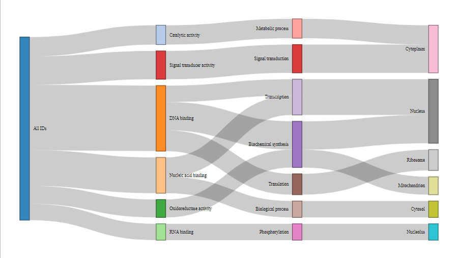

# **blastinR**

blastinR is a wrapper package that interfaces R and NCBI's blast+ suite specifically with respect to blast homology searches.
blastinR streamlines local blast searches by connecting blast+ to the R and Rstudio's downstream analysis environment.
Furthermore, blastinR includes a pipeline function that automates all steps from search, to results importation, graphical representation and 
annotation.
The package builds on blast+ taxonomy option to add additional metadata to the database, such as functional annotation that could later be used to 
annotate blast results. In addition, the package automatically logs each run, export blast and annotation results, and can output interactive html 
reports, promoting reproducible research.


## **Installation instructions:**

To install the package, use the `install_github` function from the remotes package.

```r
install.packages("remotes")
library("remotes")
remotes::install_github("idohatam/blastinR")
library("blastinR")
```

### **Requirements**

* R 4.2 or later

* [NCBI blast+](https://ftp.ncbi.nlm.nih.gov/blast/executables/blast+/LATEST/) to be installed.

You can use `check_blast_install()` to verify that blast+ tools are accessible from R:

```r
blastinR::check_blast_install()
```

## **Function list**

The following is a documentation of functions included in this package. In order to view examples their usage, please refer to the manual section, where a detailed example of the workflow is provided. Most functions have to be run in a specific order, as the output of one is the input of another. 


### **make_blast_db**

The `make_blast_db()` function is a wrapper for the `makeblastdb` function from BLAST+.
It will generate all the files required for a BLAST database. 
The `infile` argument should specify the path to a FASTA file containing all the sequences 
to be included in the database. The `outfile` argument should specify the names of all the
database files to be generated. All database files will carry the same name but will differ
in extension. 
* `dbtype` Default is `nucl`. The database type (`prot`, `nucl`)
* `taxid` The taxonomy information file. (txt file expected).

```{r mdb, eval=FALSE}
make_blast_db(infile = "PATH/TO/FILE.FASTA",outfile="my_out_file")
```


### **blstinr**

Runs BLAST on query against a local database specified by the user. 

* `btype`  argument specifies which blast type would be used, the default is `blastn`.
* `dbase`  path or name of the blast database without including any extensions.
* `qry`  path or name of the query file. Must be FASTA format.
* `taxid`  default is FALSE. FALSE means there is no file for taxonomy id. TRUE means that there is a file for taxonomy id that was used in make_blast_db function.
* `report`  default is TRUE. Generates an interactive report.
* `ncores`  default is 2. Number of threads.
* `numt`  argument specifies the number of threads to be used, only work with UNIX based OS, default value is 1. 

Returns a dataframe with blast/query results. Will output this information in the form of an interactive table in the report. 

```{r mdb, eval=FALSE}
blastinr(btype = "blastn", dbase = "PATH/TO/DATABASE/FILES", 
qry = "PATH/TO/FASTA/FILE", taxid = FALSE, report = TRUE, ncores = 2, numt = 1)
```


### **retrieve_hit_seqs**

A function to retrieve hit sequences from blast search results from within R.

* `query_ids`  vector which holds the ID of queries for which we want to retrieve their corresponding hit sequences. 
* `blast_results`  parameter is the dataframe output of the blastinr function. 
* `NumHitseqs`  default is 1. The number of hits returned.
* `outfile`  specifies the name and path of the output file.
* `cut_seq`  default is TRUE. TRUE will cut the hit sequence from start to end of match. FALSE returns the entire sequence.
* `MultFiles`  default is FALSE. if TRUE, will output one file of hit sequences for each query. FALSE places all query hits in one file. 
* `report`  default is TRUE. Generates an interactive report.
* `pipeline`  default parameter adds the function to the pipeline reporter. Set to FALSE by default and TRUE in Run_blast pipeline function.

Writes FASTA files to outfile path and returns hit sequences to the console.

```{r mdb, eval=FALSE}
retrieve_hit_seqs(query_ids, blast_results, blastdb = "PATH/TO/FASTA/FILE", 
NumHitseqs = 1, outfile= "PATH", cut_seq = TRUE,
MultFiles = FALSE, report = TRUE, pipeline = FALSE)
```

### **summarize_bl**

Can plot taxonomy or GO annotations. Receives metadata to annotate blast outputs. 

* `df1` The dataframe that has the added metadata. 
* `df2` dataframe outputted from blastinr function.
* `id_col` The column name that contains the ID to merge dataframes with.
* `summarize_cols` A vector that contains the names of the columns to summarize.
* `report` default is TRUE. Generates an interactive report.

Returns an interactive Sankey plot.

```{r mdb, eval=FALSE}
summarize_bl(df1, df2, id_col, summarize_cols, report = TRUE)
```


### **Generate_report**

One of the key features of this package is its ability to record the user's interactions with all of the functions within it. Furthermore, it will include the outputs that were generated by those functions.

Function will not require any inputs.

```{r mdb, eval=FALSE}
generate_report()
```

### **delete_report**

To delete and clear the report.

**Warning**: The report cannot be retrieved after deletion. To make a new report while keeping the old one, make a copy and change the name. Then, use this function to reset the record keeping.

```{r mdb, eval = FALSE}
delete_report()
```

------------------------------------------------------------------------------------------------
<br>

## **Getting started**

Below is a basic workflow of using the blastinR package. The workflow uses included example data, and demonstrates the core features of the package.
For more information about the functions used and their parameters, refer to the function documentations.


### **Building a local database**

Begin by creating a local blast database using the `make_blastdb` function.
The package comes with two example fasta files, one with AA sequences of spike proteins from various Coronaviruses and one with various genomes of 
Coronaviruses. In this example, spike proteins of different Coronavirus variants are used to generate an AA database.


```r
#get the spike protein fasta file and thetaxonomy table
db_seqs <- system.file("extdata","corona_spike_aa.fa",package = "blastinR" )
txid <- system.file("extdata","taxid.txt",package = "blastinR" )

# create a spike protein database from the FASTA file. 
make_blast_db(infile = db_seqs,taxids_file = txid,dbtype = "prot")

```
You should see the a similar output. 
```
--- 2024-10-26 17:54:00.140211 ---
[1] "Blast database successfully created."  "Outfile name: /path/to/corona_spike_aa"
```

>By default the blastdb will be saved to the package folder.
>You can specify the path and name of the blastdb using the outfile argument.


### **Running BLAST against the local database**

Since the database is a protein database and the query contains nucleotide sequences, we will use `blastx`.

```r
#Get the sequences of the genomes
qry_seqs <- system.file("extdata","corona_viruses_genomes.fa",package = "blastinR" )

blast_output <- blstinr('blastx', "/path/to/corona_spike_aa", qry_seqs, taxid = TRUE)
```
The output dataframe:

```
# A tibble: 123 × 14
   qseqid      sseqid pident length mismatch gapopen qstart  qend sstart  send    evalue bitscore staxids
   <chr>       <chr>   <dbl>  <int>    <int>   <int>  <int> <int>  <int> <int>     <dbl>    <dbl>   <int>
 1 Bat_corona… Bat_c…  100     1258        0       0  21578 25351     12  1269 0           2545        22
 2 Bat_corona… SARS_…   97.4   1262       29       1  21578 25351     12  1273 0           2481        55
 3 Bat_corona… SARS-…   97.0   1262       34       1  21578 25351     12  1273 0           2467        44
 4 Bat_corona… Pango…   89.7   1258      124       3  21578 25351     13  1265 0           2293        33
 5 Bat_corona… SARS_…   77.7   1246      258       6  21620 25351     28  1255 0           1988        66
 6 Bat_corona… SARS_…   77.6   1246      259       6  21620 25351     28  1255 0           1988        77
 7 Bat_corona… Camel…   34.7   1023      587      25  22331 25219    311  1312 1.82e-159    527        11
 8 Bat_corona… MERS_…   34.6   1022      589      25  22331 25219    311  1312 7.70e-159    525        99
 9 Bat_corona… MERS_…   24.2     91       50       3  16822 17049     78   164 7.9 e+  0     23.9      99
10 Bat_corona… MERS_…   34.5   1023      589      25  22331 25219    311  1312 1.91e-158    524        88
# ℹ 113 more rows
# ℹ 1 more variable: Range <int>
# ℹ Use `print(n = ...)` to see more rows
```


### **Retrieve Hit Sequences From BLAST** 

```r
# Retrieve ID vector
qry_ids <- "Bat_coronavirus"

retrieve_hit_seqs(query_ids = qry_ids, blast_results = blast_output, 
blastdb = "corona_spike_aa", NumHitseqs = 6, outfile = "prot_hit_OneFile", 
cut_seq = TRUE, MultFiles = FALSE, report = FALSE)
```

The first sequence inside the "prot_hit_OneFile.fasta" output file.

```
>Bat_coronavirus__queryID:Bat_coronavirus_sstart:12_send:1269_Orientation:+
SSQCVNLTTRTQLPPAYTNSSTRGVYYPDKVFRSSVLHLTQDLFLPFFSNVTWFHAIHVSGTNGIKRFDNPVLPFNDGVYFASTEKSNIIRGWIFGTTLDSKTQSLLIVNNATNVVIKVCEFQFCNDPFLGVYYHKNNKSWMESEFRVYSSANNCTFEYVSQPFLMDLEGKQGNFKNLREFVFKNIDGYFKIYSKHTPINLVRDLPPGFSALEPLVDLPIGINITRFQTLLALHRSYLTPGDSSSGWTAGAAAYYVGYLQPRTFLLKYNENGTITDAVDCALDPLSETKCTLKSFTVEKGIYQTSNFRVQPTDSIVRFPNITNLCPFGEVFNATTFASVYAWNRKRISNCVADYSVLYNSTSFSTFKCYGVSPTKLNDLCFTNVYADSFVITGDEVRQIAPGQTGKIADYNYKLPDDFTGCVIAWNSKHIDAKEGGNFNYLYRLFRKANLKPFERDISTEIYQAGSKPCNGQTGLNCYYPLYRYGFYPTDGVGHQPYRVVVLSFELLNAPATVCGPKKSTNLVKNKCVNFNFNGLTGTGVLTESNKKFLPFQQFGRDIADTTDAVRDPQTLEILDITPCSFGGVSVITPGTNASNQVAVLYQDVNCTEVPVAIHADQLTPTWRVYSTGSNVFQTRAGCLIGAEHVNNSYECDIPIGAGICASYQTQTNSRSVASQSIIAYTMSLGAENSVAYSNNSIAIPTNFTISVTTEILPVSMTKTSVDCTMYICGDSTECSNLLLQYGSFCTQLNRALTGIAVEQDKNTQEVFAQVKQIYKTPPIKDFGGFNFSQILPDPSKPSKRSFIEDLLFNKVTLADAGFIKQYGDCLGDIAARDLICAQKFNGLTVLPPLLTDEMIAQYTSALLAGTITSGWTFGAGAALQIPFAMQMAYRFNGIGVTQNVLYENQKLIANQFNSAIGKIQDSLSSTASALGKLQDVVNQNAQALNTLVKQLSSNFGAISSVLNDILSRLDKVEAEVQIDRLITGRLQSLQTYVTQQLIRAAEIRASANLAATKMSECVLGQSKRVDFCGKGYHLMSFPQSAPHGVVFLHVTYVPAQEKNFTTAPAICHDGKAHFPREGVFVSNGTHWFVTQRNFYEPQIITTDNTFVSGSCDVVIGIVNNTVYDPLQPELDSFKEELDKYFKNHTSPDVDLGDISGINASVVNIQKEIDRLNEVAKNLNESLIDLQELGKYEQYIKWPWYIWLGFIAGLIAIIMVTIMLCCMTSCCSCLKGCCSCGSCCKFDEDDSEPVLKGVKLHYT

```

### **Summarize** 

`summerize_bl` allows to marge data frames with matadata such asGene Ontology (GO) with the blast results and summarize is in a neat samky plot.

Let's create a faux metadata table with "GO" information.
```r
go_df2 <-  data.frame(
  ID = c(11, 22, 33, 44, 55, 66, 77, 88, 99, 14, 24, 34),
  MolecularFunction = c("Nucleic acid binding", "Nucleic acid binding", "Catalytic activity", "Oxidoreductase activity", "DNA binding", "DNA binding", "RNA binding", "Signal transducer activity", "DNA binding", "Signal transducer activity", "ATP binding", "Protein kinase activity"),
  BiologicalProcess = c("Transcription", "Biological process", "Metabolic process", "Biochemical synthesis", "Translation", "Transcription", "Phosphorylation", "Signal transduction", "Biochemical synthesis", "Signal transduction", "Transport", "Phosphorylation"),
  CellularComponent = c("Nucleus", "Cytosol", "Cytoplasm", "Mitochondrion", "Ribosome", "Nucleus", "Nucleolus", "Cytoplasm", "Nucleus", "Plasma membrane", "Cytoplasm", "Plasma membrane")
)
```


Create a sankey plot summarizing the GO components that the input data is involved in. 

```r
summarize_bl(go_df2, blast_output, id_col = "ID", 
    summarize_cols = c("MolecularFunction", "BiologicalProcess","CellularComponent"), 
  report = FALSE)
```



### **Output structure**

As you run blastinR functions they will automatically output results files, logs and reports to an outputs folder within your working directory with
the following structure.

```text
outputs/
├── hits/
│   └── your_hits.fasta
├── html/
│   └── timestamp_your_log.html
│   └── timestamp_plot_files/
└── table/
    └── timestamp_your_results.csv
    
```

### **Generate Report**


Finally, we generate a report in an html file, detailing the user's use of functions, their inputs, and outputs. 

To generate an html file, run the code below. The file will appear in your current directory.

```r
generate_report()
```

Running the code below will delete the html file, and reset the report history.

```r
delete_report()
```

### **TL;DR Run Pipeline**

It's possible to run through the entire process with the  

```r
#get the spike protein fasta file, thetaxonomy table and genomes from the package data
db_seqs <- system.file("extdata","corona_spike_aa.fa",package = "blastinR" )
txid <- system.file("extdata","taxid.txt",package = "blastinR" )

qry_seqs <- system.file("extdata","corona_viruses_genomes.fa",package = "blastinR" )

#Again, lets make a "functionl anotation" table

go_df2 <-  data.frame(
  ID = c(11, 22, 33, 44, 55, 66, 77, 88, 99, 14, 24, 34),
  MolecularFunction = c("Nucleic acid binding", "Nucleic acid binding", "Catalytic activity", "Oxidoreductase activity", "DNA binding", "DNA binding", "RNA binding", "Signal transducer activity", "DNA binding", "Signal transducer activity", "ATP binding", "Protein kinase activity"),
  BiologicalProcess = c("Transcription", "Biological process", "Metabolic process", "Biochemical synthesis", "Translation", "Transcription", "Phosphorylation", "Signal transduction", "Biochemical synthesis", "Signal transduction", "Transport", "Phosphorylation"),
  CellularComponent = c("Nucleus", "Cytosol", "Cytoplasm", "Mitochondrion", "Ribosome", "Nucleus", "Nucleolus", "Cytoplasm", "Nucleus", "Plasma membrane", "Cytoplasm", "Plasma membrane")
)

#Run the pipeline

blast_pipeline(infile = db_seqs, dbtype = "prot", taxids_file = txid, btype = "blastx",
          qry = qry_seqs,
          taxid = TRUE, ncores = 3, query_ids = c("Bat_coronavirus"), retrievSeqs_outfile = "prot_hit_OneFile", df1 = go_df2, id_col = "ID", summarize_cols = c("MolecularFunction", "BiologicalProcess","CellularComponent"))

```


## **License**

This package is licensed under the MIT License. See the [LICENSE](LICENSE) file for details.  
Copyright (c) 2025 The blastinR authors:
- Ido Hatam
- Sarah Bowker
- Sal Jahromi

